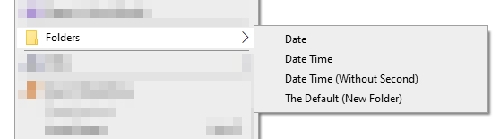

### Folder Format ###

Folder Format - Create folder with the name formated by Date Time

#### Installation ####

>1. Copy this folder `Folders` to C drive. After copied, its path will be `C:\Folders`.
>2. Run the file `Register.reg` and choose YES to apply settings into Registry.2. 

#### Screenshots ####

Website: https://vic.onl/